# Yocto Build on Google Cloud — Full Walkthrough

This guide documents how I set up a free Google Cloud VM, installed Yocto, built an image, and ran it on QEMU for ARM.
It includes **clear steps and screenshots** you can follow.

---

## Table of Contents

1. [Create Google Cloud VM](#1️⃣-create-your-yocto-build-vm-on-google-cloud)
2. [Install Yocto Build Dependencies](#2️⃣-install-yocto-build-dependencies)
3. [Clone Poky and Setup Build Environment](#3️⃣-clone-poky-and-setup-build-environment)
4. [Build the Yocto Image](#4️⃣-build-the-yocto-image)
5. [Run QEMU with Your Yocto Image](#5️⃣-run-qemu-with-your-yocto-image)
6. [Verify QEMU Network and Kernel](#6️⃣-verify-qemu-network-and-kernel)
7. [Shutdown QEMU Safely](#7️⃣-shutdown-qemu-safely)
8. [Troubleshooting](#8️⃣-troubleshooting-optional)

---

### 1️⃣ Create a free Google Cloud VM

- Sign up at https://console.cloud.google.com
- Activate your free trial ($300 credits)
- Create a project (I named mine `yocto-lab`)
- Enable **Compute Engine API** when asked
- Create a VM:
  - Ubuntu 22.04 LTS
  - Region close to you
  - `e2-standard-4` (4 vCPU, 16 GB RAM)
  - 100 GB SSD disk
  - Allow HTTP/HTTPS firewall rules

### *Screenshots:*
## 1️⃣ Create Your Yocto Build VM on Google Cloud

This guide shows exactly how I created a free-tier Google Cloud VM to build Yocto without messing up my local machine.

---

### Step 1: Open Compute Engine

In your Google Cloud Console, go to **Compute Engine → VM Instances**.

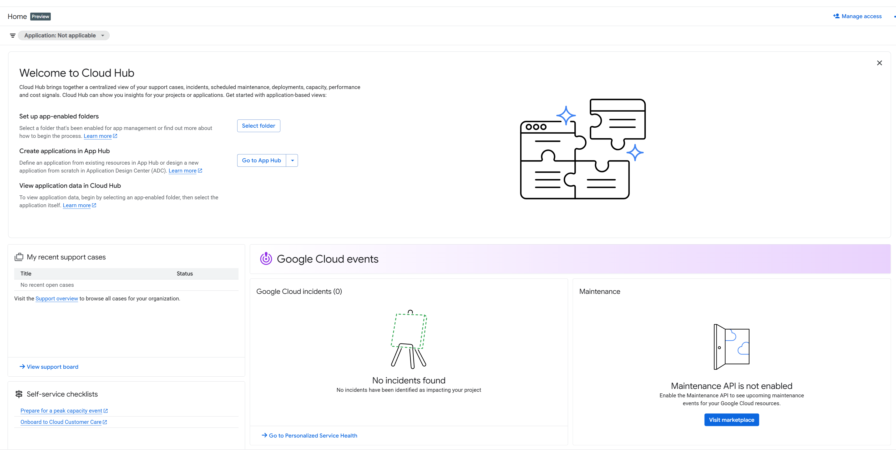

*Use the left sidebar to navigate to Compute Engine.*

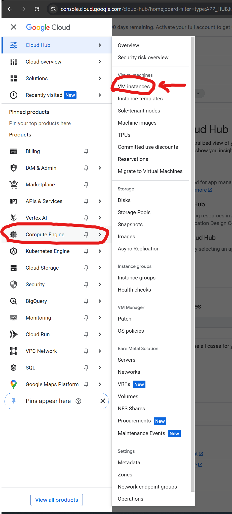

---

### Step 2: See your VM list

Once Compute Engine is enabled, you’ll see all your VM instances.
Click **“Create Instance”** to make a new VM.

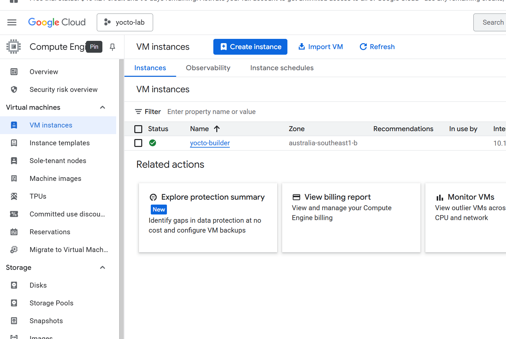

*Here you can see my `yocto-builder` VM ready to go.*

---

### Step 3: Choose machine configuration

Pick a machine series that fits the free credits but has enough RAM for a Yocto build.

- **Series:** E2 (low cost, general-purpose)
- **Machine type:** `e2-standard-4` (4 vCPU, 16 GB RAM)

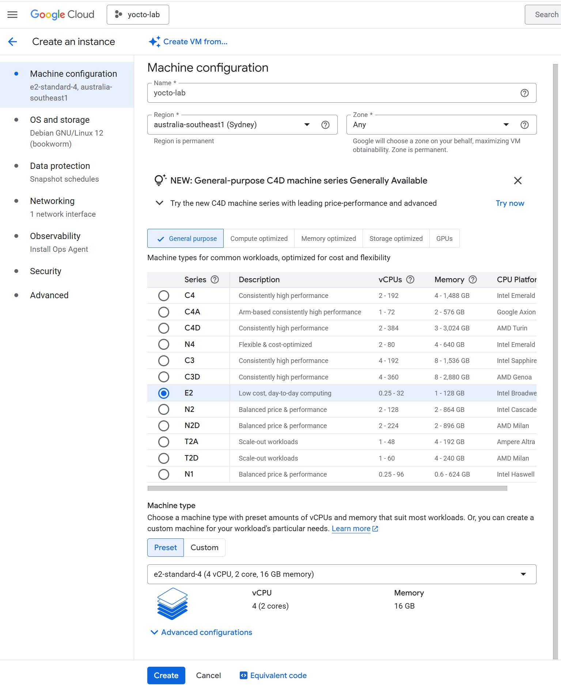

*This is affordable but fast enough for a small build.*

---

### Step 4: Select OS & Storage

For your boot disk, pick:

- **Operating System:** Ubuntu 22.04 LTS
- **Disk Size:** 100 GB SSD

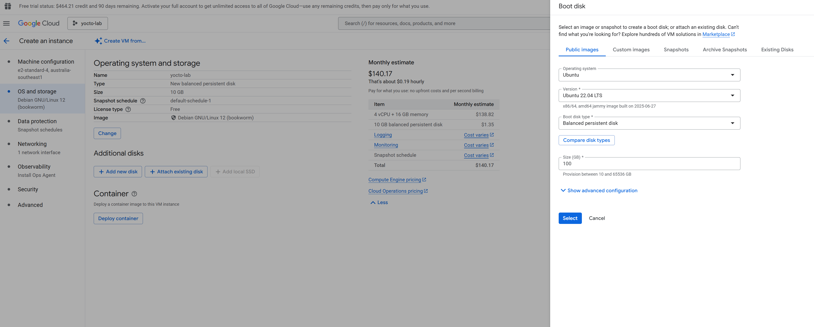

*A larger disk is better because Yocto build directories can be huge.*

---

### Step 5: Launch your VM & connect

Once it’s created, you’ll see your new VM in the list with its external IP.
Click **SSH** to connect directly in your browser.


*Click SSH to open a terminal window to your VM.*

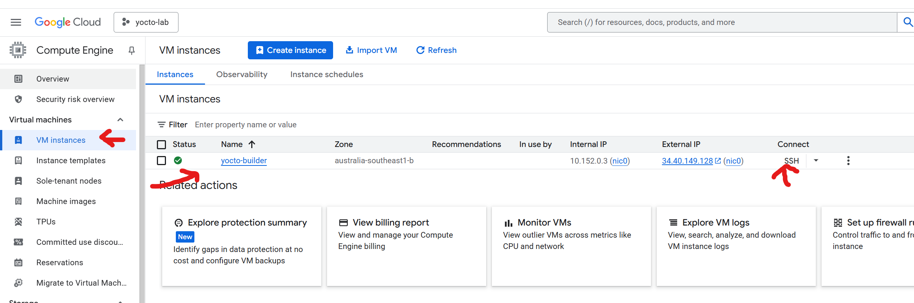
---

### Tips

✅ **Allow HTTP/HTTPS traffic** if you need to download packages.
✅ Monitor your cost — shut down the VM when done.
✅ Pin Compute Engine in the Cloud Hub for quick access.


---

## 2️⃣ Install Yocto Build Dependencies

Once you SSH into your VM, the first thing is to install all the required tools - Use the GCP Console `SSH` button.

---

### Step 1: Update & upgrade your system

```bash
sudo apt update
sudo apt upgrade -y
```

### Step 2: Install Yocto build dependencies
```bash
sudo apt update
sudo apt upgrade -y

sudo apt install -y \
    gawk wget git-core diffstat unzip texinfo gcc-multilib \
    build-essential chrpath socat cpio python3 python3-pip python3-pexpect \
    xz-utils debianutils iputils-ping libsdl1.2-dev coreutils vim
```

### Step 3: Install extra tools on demand
During your first bitbake run, you may see missing tools. For example, I needed lz4 and zip. I also like to install `htop` and `tmux` so I can monitor the build and reconnect easily.
```bash
sudo apt update
sudo apt install -y htop tree tmux lz4 zip
```

✅ Note: Keep an eye on any bitbake errors — they’ll always tell you what host tools are missing!

---

## 3️⃣ Clone Poky and Setup Build Environment

Now you’ll get the Yocto Project reference build system (**poky**) and prep the build directory.

---

### Step 1: Make a workspace folder

```bash
mkdir -p ~/yocto
cd ~/yocto
```

### Step 2: Clone Poky
```bash
git clone git://git.yoctoproject.org/poky
cd poky
```

Ensure the `poky` directory is located alongside your `build/` folder. The
`conf/bblayers.conf` in this repo expects `${TOPDIR}/../poky` to resolve to the
Poky sources.

### Step 3: Check out a stable branch
```bash
git checkout kirkstone
```

### Step 4: Initialize the build environment
```bash
source oe-init-build-env

```

This sets up your build/ folder with conf/local.conf and conf/bblayers.conf.
Example of initializing the build environment: You’ll see a message: “You had no conf/local.conf file...” — that’s expected.

---

## 4️⃣ Build the Yocto Image
You’re ready to bake your first image!

### Step 1: Edit your local.conf (Optional)
For QEMU testing, you can stick with:
```bash
MACHINE ?= "qemuarm"
```
This means you’ll build for a generic ARM machine emulated by QEMU.

### Step 2: Start the build!
```bash
bitbake core-image-sato
```
BitBake building the image. This can take a long time — watch htop in another tab if you like.

Note: Your first build will download lots of sources and may take up to a few hours. Monitor with `htop` if you like to check system resources while building

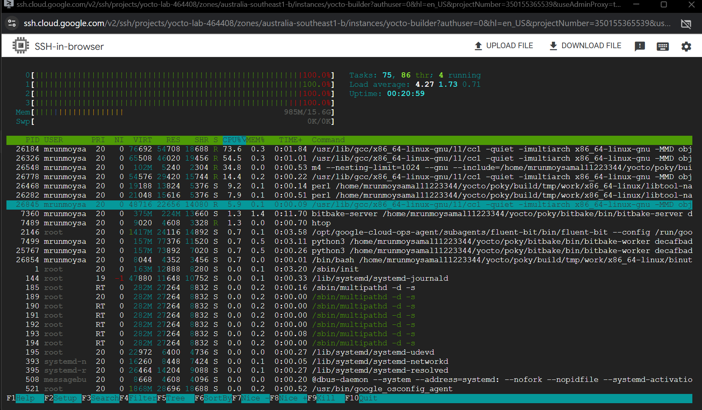

When it’s done, you’ll see the output in:

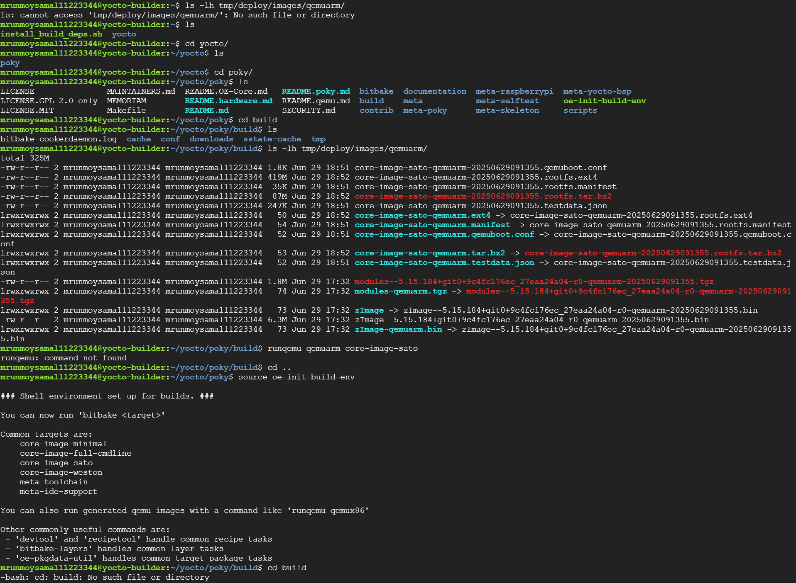

---

## 5️⃣ Run QEMU with your Yocto Image

Now boot your freshly built ARM image in QEMU to test it without hardware.

---

### Step 1: Source the build environment (if needed)

If you closed your terminal, re-source your environment inside `poky/`:

```bash
cd ~/yocto/poky
source oe-init-build-env
```

### Step 2: Boot the image
```bash
runqemu qemuarm core-image-sato nographic
```
Note: Why nographic? Your GCP VM has no GUI display (no X11/SDL), so nographic drops you into the serial console.

## 6️⃣ Verify QEMU Network and Kernel
Once you see the login prompt:
```bash
Poky (Yocto Project Reference Distro) 4.x qemuarm ttyAMA0
qemuarm login: root
```

### Step 1: Log in
```bash
login: root
```

Step 2: Check network interface
```bash
ifconfig
```

Step 3: Check your kernel version
```bash
uname -a
```

Proof that your custom Yocto-built kernel is running.

## 7️⃣ Shutdown QEMU Safely
Always shut down your QEMU guest cleanly to avoid rootfs corruption.

```bash
poweroff
```

This will safely power down the emulated machine.

---

## 8️⃣ Troubleshooting (Optional)

If you see:

```bash
runqemu - ERROR - Failed to run qemu: Could not initialize SDL(x11 not available)
```
This means you didn’t use nographic on a headless cloud VM.

Solution: run with:
```bash
runqemu qemuarm core-image-sato nographic
```

Always use nographic on servers without a GUI.


### *More Screenshots:*:

Starting QEMU in headless mode


Use `runqemu qemuarm core-image-sato nographic` to start QEMU in a terminal-only mode. This helps run headless on cloud VMs.

---

QEMU kernel boot output


Example of kernel and init system boot logs. This confirms your kernel and rootfs boot correctly inside QEMU.

---

Full system log - networking up

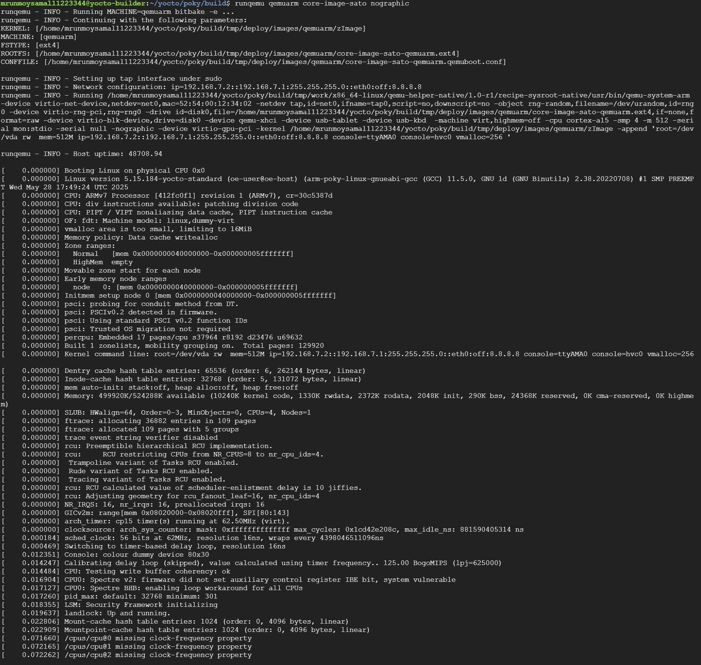

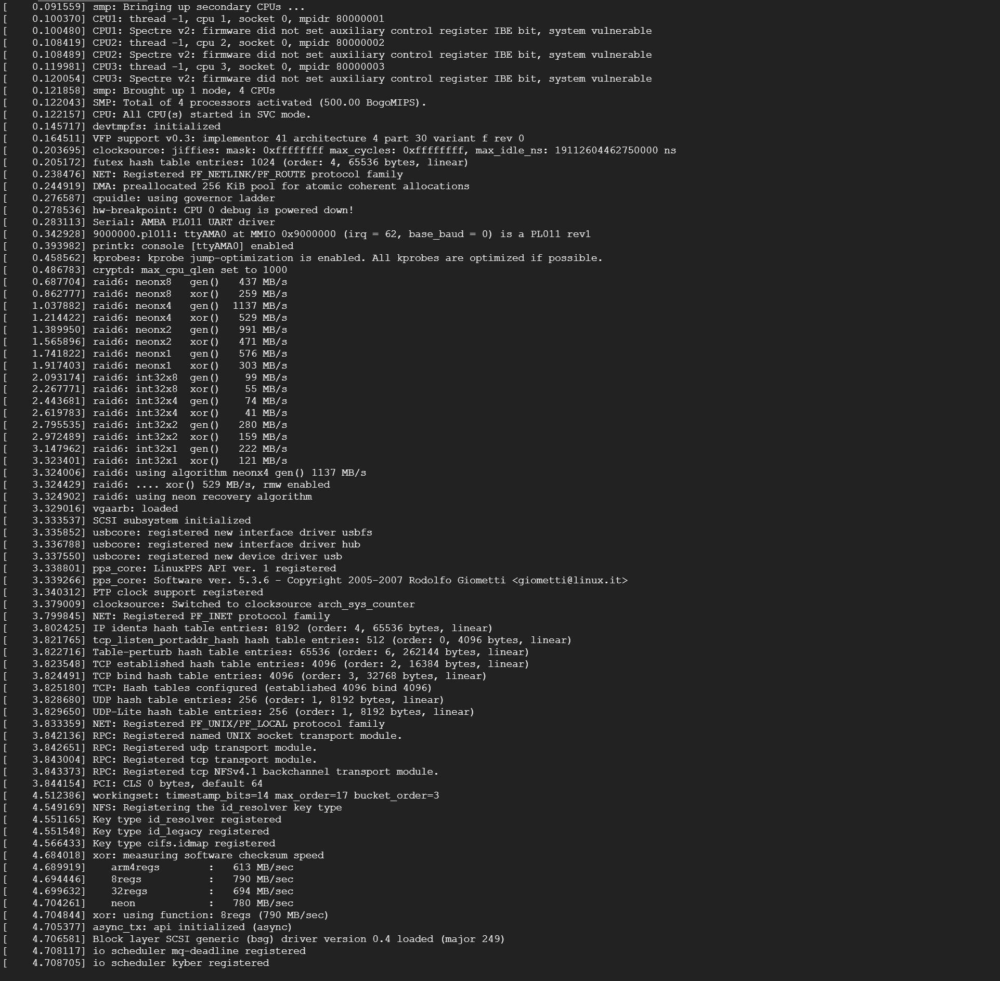

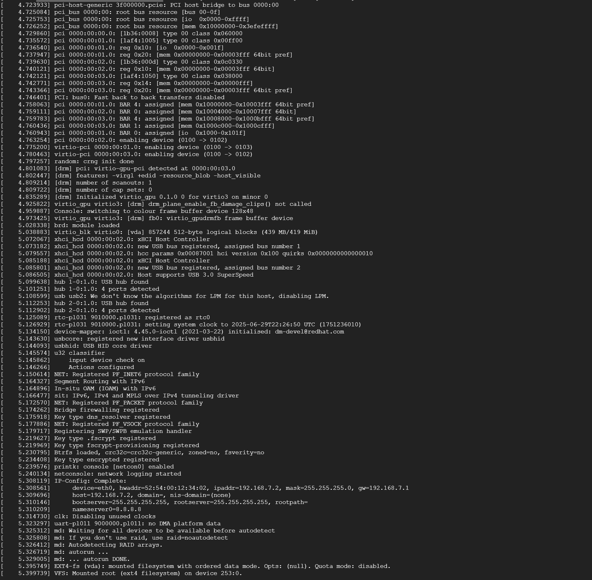

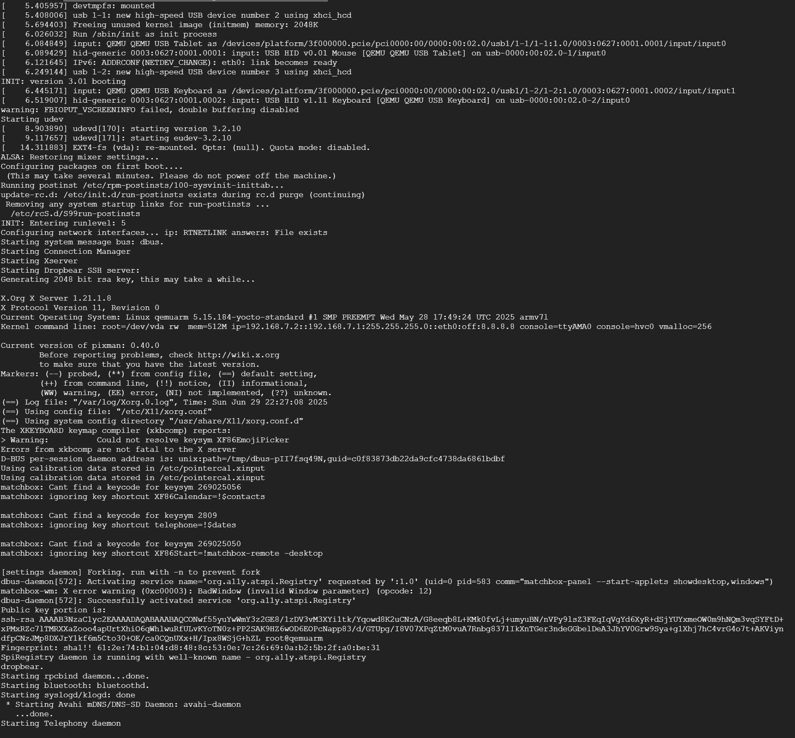

Run `ifconfig` and `uname -a` inside QEMU to verify network interfaces, IP and kernel version.

---

Graceful shutdown

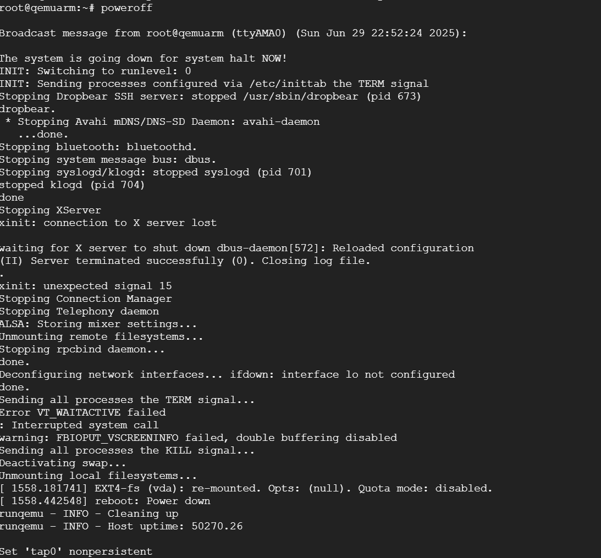


Always shut down the QEMU guest cleanly with `poweroff` to avoid corruption.

---


